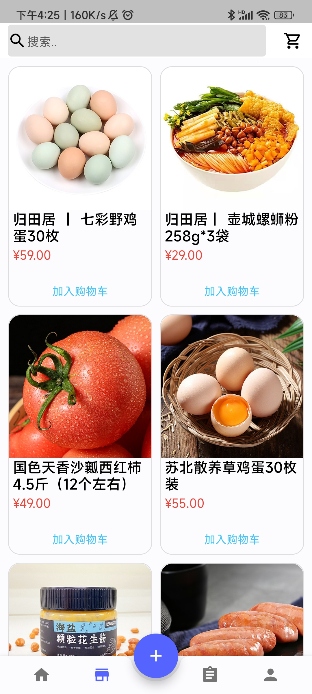

# 🍔Flutter_cook

A new Flutter App project about recipes. It's UI layout referred to [Foodybite](https://github.com/JideGuru/FlutterFoodybite).

## 📸ScreenShots

| 1. login                                                 | 2. sign in                                               | 3. home                                            | 4. dynamic                                          |
| -------------------------------------------------------- | -------------------------------------------------------- | -------------------------------------------------- | --------------------------------------------------- |
|           |         |      |    |
| **5. store**                                             | **6. shopping cart**                                     | **7. orders**                                      | **8. personage**                                    |
|           |   |    |  |
| **9. favoured**                                          | **10. setting**                                          | **11. follower**                                   | **12. fans**                                        |
|        |         |  |       |
| **13. create recipe1**                                   | **14. create recipe2**                                   | **15. recipe1**                                    | **16. recipe2**                                     |
|  |  |   |    |

## ✨Introduction

There are four modules: login registration module, home page module, store module, menu sending module and personal information module.

1. The home page module will display recommended recipes, classified recipes and user dynamics. The home page includes search, recommendation and dynamics.
   Search can fuzzy query recipes; The recommendation page displays today's recommendations and classified choices. The recipes with the most user comments and interactions are displayed as recommendations. It pays attention to the personalized division of user experience, and the selection of food materials for cuisine scenes is displayed as classification; Users will send a dynamic page while commenting on the menu.
2. The store module includes commodity display and shopping cart settlement. Users can add commodities to the shopping cart for purchase settlement according to their needs.
3. Release the recipe module. Users can add video or picture cover, introduction, materials, steps, tips, difficulty, time and classification.
4. The personal information module displays the user's personal information and personal recipes, list of concerns and fans, collection list and settings.

## 🤓Getting Started

This project is a starting point for a Flutter application.

A few resources to get you started if this is your first Flutter project:

- [Lab: Write your first Flutter app](https://flutter.dev/docs/get-started/codelab)
- [Cookbook: Useful Flutter samples](https://flutter.dev/docs/cookbook)

For help getting started with Flutter, view our
[online documentation](https://flutter.dev/docs), which offers tutorials,
samples, guidance on mobile development, and a full API reference.
